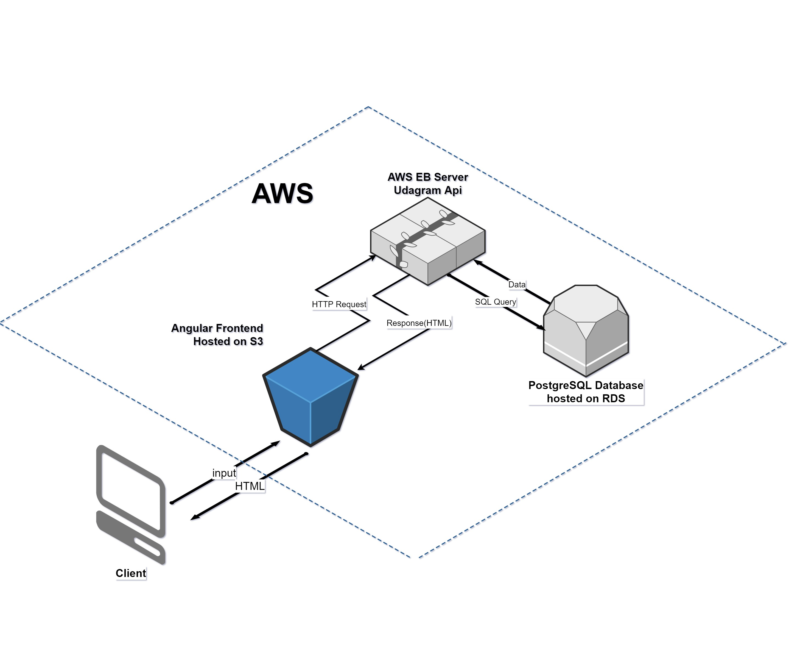

# Infrastracture
## AWS
the Project Hosted in AWS and use the following Services:
- **S3** to host the frontend Angular and the uploaded images from the backend.
- **Elastic Beanstalk** Used to Provied the API.
- **RDS** For PostgresSQL Database

