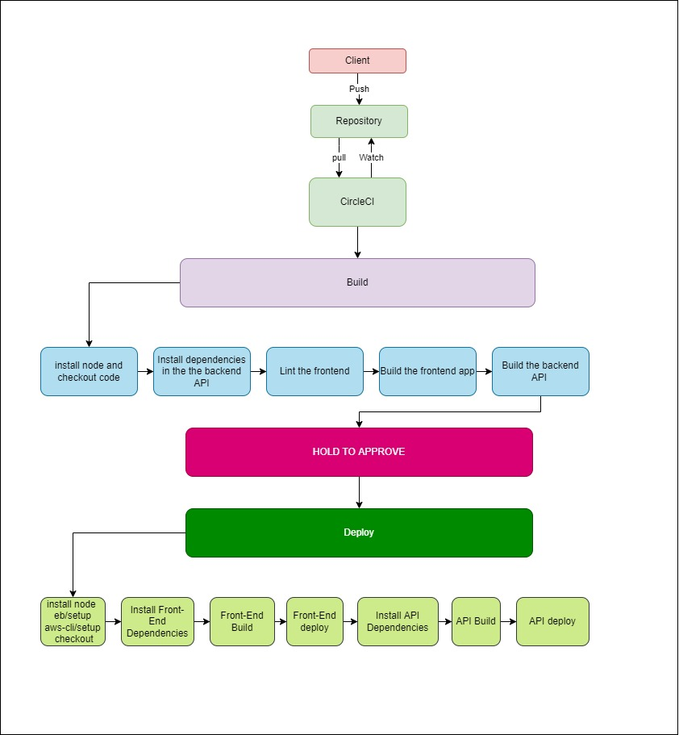

# Pipeline

## Pipeline Process
- use orbs to install Node
### build
- Use root level package.json to install dependencies in the frontend app
- Install dependencies in the the backend API   
- Lint the frontend
- Build the frontend app
- Build the backend API

### deploy
- install, build, deploy Both Frontend and BackEnd

